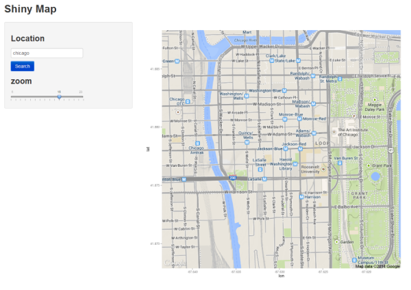

## zooming
Adjust zoom value from 10(default) to 15.



---


## Source Code--ui.R

```r
library(shiny)
library(ggmap)
shinyUI(fluidPage(
  titlePanel("Shiny Map"),
  sidebarLayout (
    sidebarPanel(
           textInput("address",label=h3("Location"),
                     value="" ),          
           submitButton("Search"),
           sliderInput("zoom",label=h3("zoom"),
                       min=5,max=20,value=10)
      ),
    
    mainPanel(
      plotOutput("map",width="800px",height="800px")
      )  
  )))
```


--- 

## Source Code--server.R

```r
library(shiny)
library(ggplot2)
library(ggmap)

shinyServer(function(input, output) {
  output$map<-renderPlot({
    
      getMap<-get_map(input$address,zoom=input$zoom)
      ggmap(getMap,extent="panel")  
})
})
```

